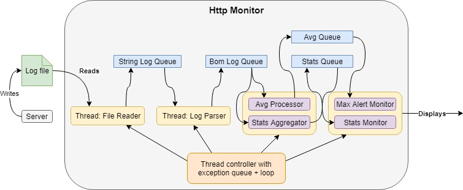

# HttpLogMonitor
HTTP log monitoring console program. This monitoring tool will monitor a log file with common log format.
## Features
It will print some statistics every n seconds related to the logs in json format. It will print the timestamp, the transactions per second, the most hit resources, the most active users and the number of status returned per category:
```json
{"time": "2018-10-08T23:36:08.331543", "tps": 15773.0, "most_hits": ["/users", "/statistics", "/api"], "most_active_users": ["Alan", "Thom", "Clara"], "status_codes": {"2xx": 5599, "3xx": 4465, "4xx": 13668
, "5xx": 6160}}
```
It will also print traffic alerts that can be configured to show when the traffic goes over a certain threshold for a certain period of time. Displayed as:
```
High traffic generated an alert - hits = 3193, triggered at 2018-10-08T23:28:49
High traffic alert recovered at 2018-10-08T23:28:53
```
Several alarms can be configured at the same time. See configuration section for more info

The output can be send to 3 different streams: stdout, as log output or to a file.

## Configuration


## Application Design

The model is based in event queues and threads. Every thread reads from a queue whenever it has items and writes to another queue, that is used by the next thread.
This model allows good decoupling between the different steps of the application and facilitates de parallelisation of the application for scalability.

The flow is divided in 4 types of jobs: reading, parsing, processing and monitoring. 

Reading and parsing simply get the lines from the file and fills a queue with the object representation of a log line.

Processing is composed of different processors, which in our case include an average calculator and a stats aggregator. These two processes puts the elements in a queue, that will be read by the monitoring processes.

The monitoring reads the processed data and outputs the relevant information through the desired stream. In this application the monitors are the max transaction alert and the stats displayer.

The following image illustrates schematically the current application structure following the event queues design:



## Installation
```bash
# Building image
docker build -t http_monitor .

# Deploying 
docker run -it --rm -v /path/to/log/folder:/var/log:ro http_monitor
```


## Testing
### Env setup
```bash
cd /path/to/app
virtualenv venv
source venv/bin/activate
pip install -r requirements.txt
```
### Unit tests
The folder regression contains a test for the alert mechanism
```bash
python -m pytest
```
### Application tests
Run the log generator in one window (Or as background process)
```bash
python log_generator.py
```
Deploy application in another window and check that logs are printed and alert is triggered and recovered
```bash
python main.py -f logs/access.log
```

